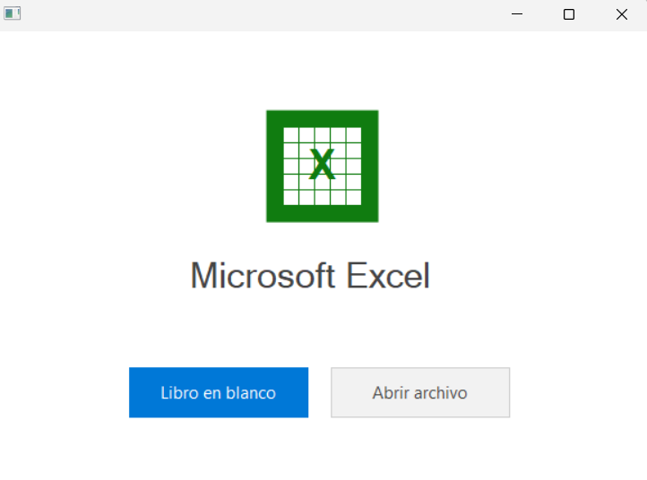
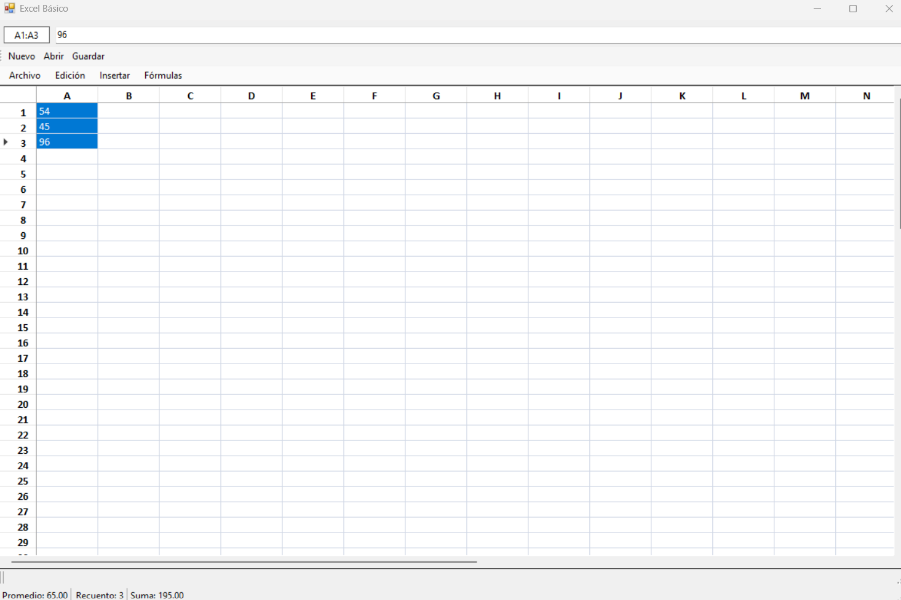
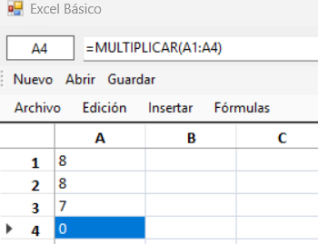

# 📊 Excel Básico

Aplicación de escritorio tipo hoja de cálculo desarrollada con **C#** y **Windows Forms**.

## 📋 Tecnologías utilizadas

- C#
- Windows Forms (.NET)
- Visual Studio

## ✨ Características

- Crear libro nuevo, abrir archivo y guardar
- Guardar como CSV o como todos los archivos
- Copiar, cortar y pegar celdas
- Insertar fila o columna
- Fórmulas: suma, resta, multiplicar, dividir, promedio, máximo, mínimo, contar
- Barra de estado con promedio, recuento y suma de la selección actual

## 📸 Capturas del programa

### Pantalla de inicio


### Hoja de cálculo


### Menú de fórmulas


## 🚀 Cómo ejecutar el proyecto

1. Clonar el repositorio
   ```
   git clone https://github.com/Vanessa1356458/ProyectoExcel.git
   cd ProyectoExcel
   ```
2. Abrir el archivo `Excel.sln` con Visual Studio
3. Restaurar los paquetes NuGet si Visual Studio lo pide
4. Compilar el proyecto (Ctrl+Shift+B)
5. Ejecutar (F5)

## 📁 Estructura del proyecto

    ProyectoExcel/
    ├── Properties/          # Propiedades del proyecto
    ├── Form1.cs             # Formulario principal
    ├── FormularioInicio.cs  # Pantalla de inicio (libro en blanco / abrir archivo)
    ├── Formulas.cs          # Lógica de las fórmulas (suma, resta, etc)
    ├── GestorArchivos.cs    # Abrir, guardar y guardar como
    ├── GestorHojaCalculo.cs # Manejo general de la hoja de cálculo
    ├── GestorSeleccion.cs   # Copiar, cortar, pegar, selección de celdas
    ├── BarraEstado.cs       # Barra inferior de promedio, recuento y suma
    ├── App.config
    └── Program.cs

## 👩‍💻 Autora

Vanessa Rodriguez - Ingenieria en Sistemas
